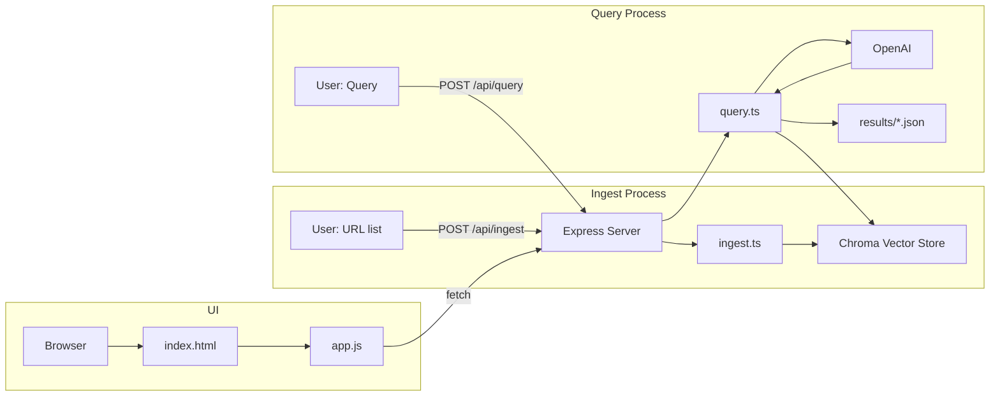

# reliable-rag

A minimal Retrieval-Augmented Generation (RAG) scaffold for ingesting web URLs into a vector store and querying them via a simple UI.

## 📖 README

### Overview
This lightweight project lets you:

1. **Ingest** web pages (URLs) → chunk text → store embeddings in Chroma.
2. **Query** that store via a RAG pipeline (retrieval → filter → generate) using OpenAI & Cohere.
3. **Serve** a local HTML/JS UI to manage ingestion and run queries.

### 🏗️ Architecture



# Setup & Installation
## Clone & enter

```bash
bash
git clone <repo-url> reliable-rag
cd reliable-rag
```

# Env vars: Create a .env file:

```bash
OPENAI_API_KEY=your_key_here
COHERE_API_KEY=your_key_here
CHROMA_SERVER_URL=http://localhost:8000
```

# Install dependencies (using pnpm or npm):

```bash
nvm use
pnpm install
# or
npm install
```

Run Chroma: If self‑hosting, start your Chroma DB at the URL above.

# ▶️ Running Locally
## Start server & UI

```bash
pnpm start
```

Then open http://localhost:3000 in your browser.


# Project Structure

```bash
reliable-rag/
├── .gitignore
├── package.json
├── tsconfig.json
├── ingest.ts
├── query.ts
├── server.ts
├── results/           # (auto-created) query outputs
└── public/
    ├── index.html
    └── app.js
```
